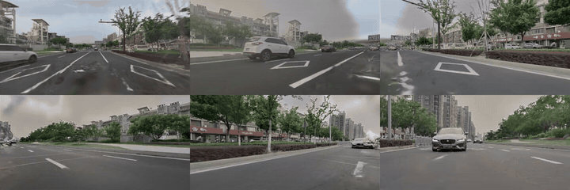
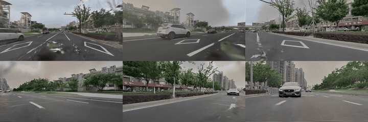
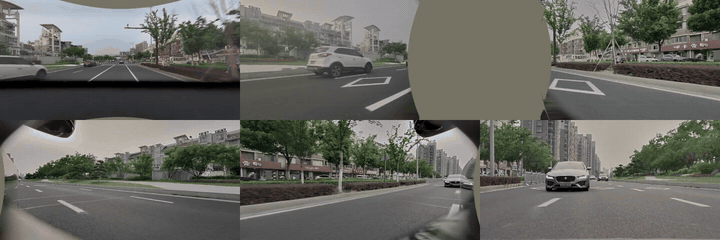
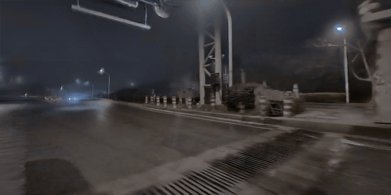

# OmniRe-based Dynamic 3DGS Case Studies

Qualitative demonstrations of dynamic urban-scene reconstruction and novel-view synthesis built around the official **OmniRe / DriveStudio** workflow.

基于官方 **OmniRe / DriveStudio** 流程整理的动态驾驶场景 3D Gaussian Splatting 案例，重点展示 Rigid Node 初始化修复、场景重建与新视角合成效果。

> The videos in this repository are experimental results from this project, not official OmniRe assets.

## Highlights

- **Rigid Node initialization repair:** generate pseudo-LiDAR initialization points from camera-ray and 3D-box intersections when LiDAR annotations are missing.
- **Dynamic scene reconstruction:** reconstruct urban driving scenes with static and dynamic Gaussian representations.
- **Novel-view synthesis:** render viewpoints that are not directly observed by the input cameras.

## Qualitative Results

Animated GIFs are embedded for quick preview. Click any preview to open the original MP4.

### 1. Rigid Node Initialization Repair

The repair improves dynamic-object reconstruction when missing LiDAR annotations cause Rigid Node initialization to fail.

| Before repair | After repair | Ground truth |
|:---:|:---:|:---:|
| [](assets/videos/rigid-node-repair/before.mp4) | [](assets/videos/rigid-node-repair/after.mp4) | [](assets/videos/rigid-node-repair/ground-truth.mp4) |
| 5 s · 1536×512 · 10 FPS | 5 s · 1536×512 · 10 FPS | 5 s · 1536×512 · 10 FPS |

### 2. Reconstruction and Novel-view Synthesis

| Reconstruction | Ground truth | Novel view |
|:---:|:---:|:---:|
| [](assets/videos/reconstruction-and-nvs/reconstruction.mp4) | [](assets/videos/reconstruction-and-nvs/ground-truth.mp4) | [](assets/videos/reconstruction-and-nvs/novel-view.mp4) |
| 10 s · 2048×1024 · 10 FPS | 10 s · 2048×1024 · 10 FPS | 4 s · 1024×512 · 24 FPS |

## Upstream OmniRe

OmniRe is released through the official [DriveStudio repository](https://github.com/ziyc/drivestudio). It models urban driving scenes with multiple Gaussian representations for backgrounds, vehicles, pedestrians, cyclists, and other non-rigid actors.

- [Official code: DriveStudio](https://github.com/ziyc/drivestudio)
- [OmniRe project page](https://ziyc.github.io/omnire/)
- [Paper](https://arxiv.org/abs/2408.16760)

### Standard Installation

```bash
git clone --recursive https://github.com/ziyc/drivestudio.git
cd drivestudio

conda create -n drivestudio python=3.9 -y
conda activate drivestudio
pip install -r requirements.txt
pip install git+https://github.com/nerfstudio-project/gsplat.git@v1.3.0
pip install git+https://github.com/facebookresearch/pytorch3d.git
pip install git+https://github.com/NVlabs/nvdiffrast

cd third_party/smplx/
pip install -e .
cd ../..
```

### Standard OmniRe Training Entry

```bash
export PYTHONPATH="$(pwd)"

python tools/train.py \
  --config_file configs/omnire.yaml \
  --output_root logs/omnire_waymo \
  --project recon \
  --run_name scene_000 \
  dataset=waymo/3cams \
  data.scene_idx=0 \
  data.start_timestep=0 \
  data.end_timestep=-1
```

A reusable version of this launcher is provided in [`scripts/run_omnire.sh`](scripts/run_omnire.sh). Dataset preparation should follow the official DriveStudio documentation.

## Repository Layout

```text
.
├── README.md
├── UPLOAD.md
├── assets/
│   ├── gifs/                 # Embedded README previews
│   │   ├── rigid-node-repair/
│   │   └── reconstruction-and-nvs/
│   └── videos/               # Original MP4 results
│       ├── rigid-node-repair/
│       └── reconstruction-and-nvs/
├── references/
│   └── omnire.bib
└── scripts/
    └── run_omnire.sh
```

## Citation

If you use OmniRe or DriveStudio, please cite the original work:

```bibtex
@inproceedings{chen2025omnire,
  title     = {OmniRe: Omni Urban Scene Reconstruction},
  author    = {Ziyu Chen and Jiawei Yang and Jiahui Huang and Riccardo de Lutio and Janick Martinez Esturo and Boris Ivanovic and Or Litany and Zan Gojcic and Sanja Fidler and Marco Pavone and Li Song and Yue Wang},
  booktitle = {The Thirteenth International Conference on Learning Representations},
  year      = {2025}
}
```

## Acknowledgements

This showcase builds on the official [OmniRe / DriveStudio](https://github.com/ziyc/drivestudio) project. Please refer to the upstream repository for source code, licensing terms, dataset preparation, and complete reproduction instructions.
